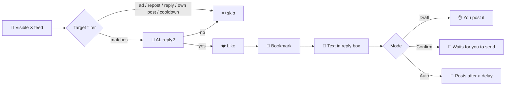

<div align="center">

# ⚡ issa autopilot

**X feed automation right in your browser:<br>like ❤️ → bookmark 🔖 → AI reply 💬 — with daily limits, delays and an emergency stop.**

[](https://developer.chrome.com/docs/extensions/mv3/)
[](#)
[](https://openrouter.ai)
[](#-tests)
[](LICENSE)
[](manifest.json)

[🇷🇺 Русский](README.ru.md) · **🇬🇧 English**

[Features](#-features) · [How it works](#-how-it-works) · [Installation](#-installation) · [Settings](#%EF%B8%8F-settings) · [Structure](#-project-structure)

</div>

---

## ✨ Features

| | |
|---|---|
| 🤖 **AI replies** | Short, on-topic replies via any OpenAI-compatible API (free OpenRouter by default) |
| ❤️ **Auto-like** | The post is liked before replying; already-liked posts are left alone |
| 🔖 **Auto-bookmark** | The post is bookmarked — even when the button is hidden in the Share menu |
| 🎛️ **3 modes** | Draft → Confirm → Automatic: choose how much control you keep |
| ⏱️ **Limits & delays** | Daily cap, randomized delays, per-author cooldown, batch size |
| 🛑 **Emergency stop** | One button stops everything — on any tab |
| 📊 **Dashboard** | Replies, likes and bookmarks per day, a daily chart and color-coded logs |
| 🧠 **Multiple prompts** | Define prompt variants — a random one is picked for each post |

## 🔄 How it works



1. The extension collects suitable posts from the visible feed (and scrolls for more if needed). **Ads are skipped** — posts with the `Ad` / `Promoted` / `Реклама` label or without a timestamp never get a like, bookmark or reply; they are re-checked right before every action and logged as `AD skip`.
2. The AI decides whether a reply makes sense and drafts a short one.
3. If the reply passes — the post is **liked** and **bookmarked**.
4. The reply box opens, the text is inserted and — depending on the mode — published.

## 🎛️ Modes

| Mode | Like + bookmark | Publishing | Iterations |
|---|:---:|---|:---:|
| 📝 **Draft** (`Черновик`) | ✅ | Manual | 1 |
| 👀 **Confirm** (`Подтверждение`) | ✅ | You click "Reply" yourself | several |
| 🚀 **Automatic** (`Автоматический`) | ✅ | Automatic, after a random delay | up to daily cap |

Like and bookmark can each be turned off in the **"Режим и аккаунт"** (Mode & account) section.

> [!NOTE]
> The extension UI is in Russian. Button names are given below with translations.

## 🚀 Installation

1. **Download:** green **Code → Download ZIP** button, then unzip.
2. **Key:** create an OpenRouter API key — <https://openrouter.ai/settings/keys>.
3. Open `chrome://extensions` and enable **Developer mode**.
4. **Load unpacked** → select the unzipped folder (the one containing `manifest.json`).
5. Open the extension settings → **"Выбрать OpenRouter Free"** (Select OpenRouter Free) → paste the key → **"Сохранить настройки"** (Save).
6. Open (or reload) x.com and click **"Собрать и запустить"** (Collect & run) in the **`[ ISSA ]`** panel on the right.

> [!TIP]
> Start in **Draft** mode to see what the AI generates before turning on automation.

## ⚙️ Settings

<details>
<summary><b>AI provider</b></summary>

OpenRouter Free Router is used by default:

```text
Endpoint: https://openrouter.ai/api/v1
Path:     /chat/completions
Model:    openrouter/free
```

For a local model (e.g. Hermes) set the endpoint to `http://127.0.0.1:8642` and the path to `/v1/chat/completions`.
Config and API key are stored locally in `chrome.storage` only and are never written to logs.

</details>

<details>
<summary><b>Default limits</b></summary>

| Setting | Value |
|---|---|
| Posts per batch | 5 |
| Daily reply cap | 20 |
| Delay between posts | 45–120 s |
| Delay before auto-send | 3–8 s |
| Per-author cooldown | 24 h |
| Minimum post length | 31 chars |

</details>

<details>
<summary><b>Prompts</b></summary>

The main prompt asks the model to return JSON `{"reply":"...","shouldReply":true}`.
In the additional prompt variants field you can list several variants separated by `---` — a random one is used for each post.

</details>

## 📊 Dashboard

The **"Дашборд"** (Dashboard) tab shows today's replies, likes and bookmarks, daily cap progress, AI requests and errors, and a chart of replies per day. Logs mark actions as `LIKE OK` / `BOOKMARK OK` (or `ERROR` with a reason).

## 📁 Project structure

```text
issa-autopilot/
├── manifest.json        # Manifest V3
├── package.json         # npm test
├── src/
│   ├── background.js    # service worker: AI requests, config, emergency stop
│   ├── content.js       # works with the X feed: targets, like, bookmark, reply
│   ├── domain.js        # pure logic: filters, limits, AI response parsing
│   ├── options.html     # dashboard & settings
│   └── options.js
└── tests/
    └── domain.test.js   # unit tests with node:test
```

## 🧪 Tests

```bash
npm test
```

Requires Node.js 18+; no external dependencies.

## ⚠️ Important

- X's interface changes often — if a like or bookmark fails, it shows up in the log and the reply continues.
- Abusive automation violates [X's rules](https://help.x.com/en/rules-and-policies/x-automation): X limits daily actions and may restrict your account. Keep limits and delays moderate and use at your own risk.
