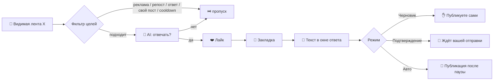

<div align="center">

# ⚡ issa autopilot

**Автоматизация работы с лентой X прямо в браузере:<br>лайк ❤️ → закладка 🔖 → AI-ответ 💬 — с лимитами, паузами и аварийной остановкой.**

[](https://developer.chrome.com/docs/extensions/mv3/)
[](#)
[](https://openrouter.ai)
[](#-тесты)
[](LICENSE)
[](manifest.json)

**🇷🇺 Русский** · [🇬🇧 English](README.md)

[Возможности](#-возможности) · [Как это работает](#-как-это-работает) · [Установка](#-установка) · [Настройки](#%EF%B8%8F-настройки) · [Структура](#-структура-проекта)

</div>

---

## ✨ Возможности

| | |
|---|---|
| 🤖 **AI-ответы** | Короткие ответы по теме поста через любой OpenAI-совместимый API (по умолчанию — бесплатный OpenRouter) |
| ❤️ **Автолайки** | Пост лайкается перед ответом; уже лайкнутые посты не трогаются |
| 🔖 **Автозакладки** | Пост уходит в закладки — даже если кнопка спрятана в меню «Поделиться» |
| 🎛️ **3 режима** | Черновик → Подтверждение → Автоматический: выбирайте уровень контроля |
| ⏱️ **Лимиты и паузы** | Дневной лимит, случайные задержки, cooldown на автора, размер раунда |
| 🛑 **Аварийная остановка** | Одна кнопка останавливает всё — на любой вкладке |
| 📊 **Дашборд** | Ответы, лайки, закладки за день, график по дням и цветные логи |
| 🧠 **Несколько промптов** | Можно задать варианты prompt — для каждого поста выбирается случайный |

## 🔄 Как это работает



1. Расширение собирает подходящие посты из видимой ленты (и докручивает её, если целей мало).
2. AI решает, стоит ли отвечать, и готовит короткий ответ.
3. Если ответ подходит — пост **лайкается** и **добавляется в закладки**.
4. Открывается окно ответа, текст вставляется и — в зависимости от режима — публикуется.

## 🎛️ Режимы

| Режим | Лайк + закладка | Публикация | Итерации |
|---|:---:|---|:---:|
| 📝 **Черновик** | ✅ | Вручную | 1 |
| 👀 **Подтверждение** | ✅ | Вы нажимаете «Ответить» сами | несколько |
| 🚀 **Автоматический** | ✅ | Сама, после случайной паузы | до дневного лимита |

Лайк и закладку можно выключить по отдельности в разделе **«Режим и аккаунт»**.

## 🚀 Установка

1. **Скачать:** зелёная кнопка **Code → Download ZIP**, распаковать.
2. **Ключ:** создать API key в OpenRouter — <https://openrouter.ai/settings/keys>.
3. Открыть `chrome://extensions` и включить **Developer mode**.
4. **Load unpacked** → выбрать распакованную папку (ту, где лежит `manifest.json`).
5. Открыть настройки расширения → **«Выбрать OpenRouter Free»** → вставить ключ → **«Сохранить»**.
6. Открыть (или обновить) x.com и нажать **«Собрать и запустить»** в панели **`[ ISSA ]`** справа.

> [!TIP]
> Начните с режима **Черновик**, чтобы посмотреть, какие ответы генерирует AI, прежде чем включать автоматику.

## ⚙️ Настройки

<details>
<summary><b>AI-провайдер</b></summary>

По умолчанию используется OpenRouter Free Router:

```text
Endpoint: https://openrouter.ai/api/v1
Path:     /chat/completions
Model:    openrouter/free
```

Для локальной модели (например, Hermes) замените endpoint на `http://127.0.0.1:8642`, а path — на `/v1/chat/completions`.
Конфигурация и ключ хранятся только локально в `chrome.storage` и не пишутся в логи.

</details>

<details>
<summary><b>Ограничения по умолчанию</b></summary>

| Параметр | Значение |
|---|---|
| Постов за раунд | 5 |
| Дневной лимит ответов | 20 |
| Пауза между постами | 45–120 с |
| Пауза перед автоотправкой | 3–8 с |
| Cooldown на автора | 24 ч |
| Минимальная длина поста | 31 символ |

</details>

<details>
<summary><b>Промпты</b></summary>

Основной prompt просит модель вернуть JSON `{"reply":"...","shouldReply":true}`.
В поле «Дополнительные prompt-варианты» можно перечислить несколько вариантов через `---` — для каждого поста выбирается случайный.

</details>

## 📊 Дашборд

Вкладка **«Дашборд»** показывает ответы, лайки и закладки за сегодня, прогресс дневного лимита, AI-запросы и ошибки, а также график ответов по дням. В логах действия помечены как `LIKE OK` / `BOOKMARK OK` (или `ERROR` с причиной).

## 📁 Структура проекта

```text
issa-autopilot/
├── manifest.json        # Manifest V3
├── package.json         # npm test
├── src/
│   ├── background.js    # service worker: запросы к AI, конфиг, аварийная остановка
│   ├── content.js       # работа с лентой X: сбор целей, лайк, закладка, ответ
│   ├── domain.js        # чистая логика: фильтры, лимиты, парсинг ответа AI
│   ├── options.html     # дашборд и настройки
│   └── options.js
└── tests/
    └── domain.test.js   # unit-тесты на node:test
```

## 🧪 Тесты

```bash
npm test
```

Нужен Node.js 18+; внешних зависимостей нет.

## ⚠️ Важно

- Интерфейс X часто меняется — если лайк или закладка не сработали, это видно в логе, а ответ продолжается.
- Автоматизация действий нарушает [правила X](https://help.x.com/en/rules-and-policies/x-automation) при злоупотреблении: X ограничивает число действий в сутки и может заблокировать аккаунт. Держите лимиты и паузы умеренными и используйте на свой риск.

## 🙏 Благодарности

Основано на [tim2cc/x_reply](https://github.com/tim2cc/x_reply) (Volya Replywise). В этой версии добавлены автоматические лайки, закладки и расширенный дашборд.

## 📄 Лицензия

[PolyForm Noncommercial License 1.0.0](LICENSE) — как и у оригинала. Использование, копирование, изменение и распространение разрешены бесплатно только в некоммерческих целях.
